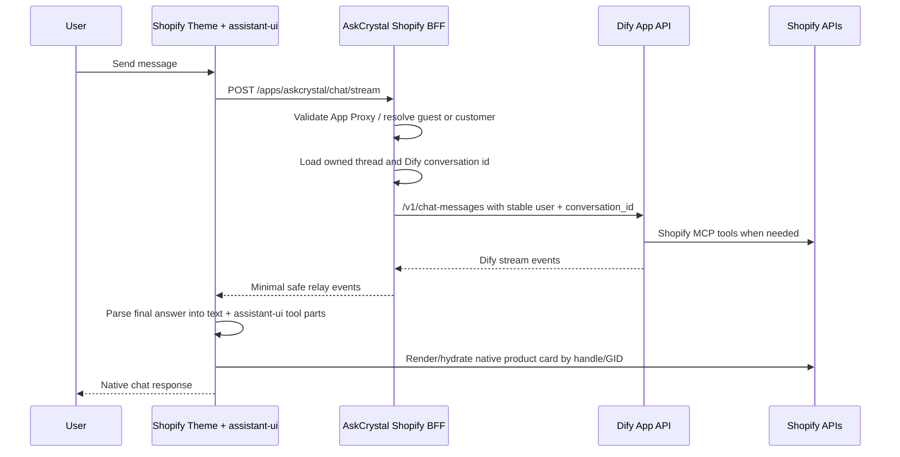
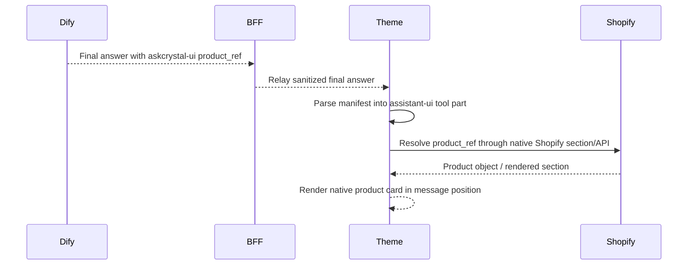

# Dify + Shopify Native Chat Transition

## Purpose

AskCrystal needs to keep Dify as the agent runtime while still delivering a native Shopify commerce experience. The current instability came from letting the Shopify proxy and storefront reimplement too much of Dify's runtime behavior: streaming interpretation, thought filtering, suggestion generation, product inference, recovery, and component hydration all started to overlap.

The transition goal is:

- Dify owns agent reasoning, tool use, conversation behavior, and suggested follow-ups.
- Shopify owns customer identity, access control, products, checkout, and native product presentation.
- The AskCrystal backend is a thin, trusted BFF, not a second agent runtime.
- The storefront renders clean assistant-ui message parts and native Shopify product UI from a tiny explicit contract.

This document is the working source of truth while moving from the current fat proxy toward a smaller, more durable runtime.

## Non-Negotiables

- Product-card UX is essential. Product recommendations must render as native Shopify product surfaces, not plain text links.
- Shopify customer identity is essential. Future memory, subscriptions, entitlements, and upsell logic must attach to Shopify-side identity, not browser-only state.
- Dify should remain the source of truth for agent execution. We should not rebuild Dify's agent loop in the proxy.
- End users must never see explicit thinking text, ReAct scratchpad, workflow payloads, raw MCP observations, or hidden JSON contracts.
- The solution must be mobile-first and stable under long tool runs.
- Do not build a compatibility layer for the old implementation. Migration should retire old proxy-era behavior instead of preserving it behind adapters.

## Current Pain

The current architecture works in pieces, but the boundaries are too blurry:

- The proxy parses Dify SSE events and also tries to classify reasoning, final output, components, suggestions, tool status, and hydration.
- The frontend parses hidden manifests and suggestions while also maintaining local sessions, recovery, simulated streaming, assistant-ui state, and component rendering.
- Product cards have sometimes been inferred from tool observations instead of being intentionally emitted by the agent.
- Suggestion behavior has moved between Dify native features, inline hidden blocks, proxy filtering, and frontend fallback logic.
- Every edge-case patch increases the chance of mobile memory pressure and out-of-memory crashes.

The fix is not "no proxy." A backend is still required for Shopify auth, Dify API-key protection, persistence, and entitlements. The fix is a thinner proxy with stricter contracts.

## No Legacy Compatibility Layer

The transition should be a boundary reset, not a compatibility project.

Avoid adding any code whose main purpose is to keep old behavior alive, including:

- accepting multiple historical product-card schemas,
- supporting old inferred component payloads from raw MCP observations,
- keeping proxy-side suggestion fallbacks for older prompt variants,
- carrying old session or message shapes forward without a product reason,
- duplicating parsing in both proxy and frontend to support legacy output,
- adding adapter layers that translate old hidden blocks into the new contract.

Allowed temporary migration work:

- one-time data cleanup or thread/message normalization,
- feature flags that choose old runtime or new runtime during a short manual rollout window,
- clear logging that identifies old-shape payloads so we can fix Dify prompt/output at the source.

Temporary means short-lived and removal-tracked. If supporting an old behavior requires ongoing code paths, the answer should usually be no. Fix the Dify prompt, workflow output, or storefront contract instead.

## Target Boundary

| Layer | Owns | Must Not Own |
| --- | --- | --- |
| Dify agent | Reasoning, tool calls, workflow routing, final answer, Dify conversation continuity, native suggested questions | Shopify auth, customer entitlements, frontend rendering implementation |
| AskCrystal Shopify BFF | App Proxy validation, customer/guest identity, Dify API key protection, Dify `user` mapping, conversation id mapping, persistence, minimal relay | Product recommendation inference, suggestion rewriting, chain-of-thought interpretation, custom agent loop |
| Shopify storefront theme | assistant-ui display, native Shopify product card rendering, visible text sanitization, component placement, mobile UX | Dify tool execution, catalog truth, customer authority |
| Shopify platform | Customer accounts, products, variants, checkout, orders, subscriptions | Agent state |

## Recommended Architecture



## Backend Shape

The BFF should keep these endpoint families:

- `identity/*`: bootstrap guest/customer identity, validate Shopify signed context, and return owned session/thread metadata.
- `threads/*`: list, create, rename, delete, and retrieve messages for the current identity.
- `chat/*`: relay messages to Dify with server-side credentials and persist the resulting turn.
- `cart/*`: Shopify cart operations that require server mediation.
- `catalog/*`: optional storefront helpers for frontend hydration only, not agent reasoning.

The BFF should not:

- invent or choose product recommendations from raw tool output,
- rewrite Dify's suggested questions,
- create generic fallback suggestions,
- expose raw workflow/tool observations to the browser,
- decide which hidden Dify output is "actually" the final answer through fragile heuristics unless Dify forces us to,
- persist large raw SSE payloads in browser state.

## Chat Relay Contract

The relay should pass only stable, user-facing events to the storefront:

```json
{"type":"message_delta","text":"visible answer text only"}
{"type":"message_end","answer":"final visible answer","conversationId":"...","messageId":"...","components":[],"suggestions":[]}
{"type":"status","stage":"running","message":"Reading the chart...","elapsedMs":12000}
{"type":"error","message":"The reading could not complete."}
```

If Dify provides clean streaming final-answer deltas, relay those. If Dify streams internal reasoning mixed with output, buffer until the final answer is safe. Do not expose hidden reasoning just to create a streaming illusion.

For product and suggestion metadata, there are two acceptable sources:

- Preferred: Dify native structured fields or native suggested-question API results.
- Fallback: hidden final-answer blocks emitted by the Dify prompt and stripped by the frontend.

The fallback is a presentation contract, not an agent runtime.

## UI Component Contract

Dify should emit UI only when the user is receiving a concrete shopping or comparison result. The manifest must be tiny and reference-only. It should never carry full product JSON.

Use this final-answer block:

````markdown
```askcrystal-ui
{"schema_version":1,"components":[{"component":"product_card","id":"sleep-primary","props":{"reason":"Best fit for quieting mental noise before sleep.","product_ref":{"handle":"tool-returned-handle"}}}]}
```
````

Allowed component types for the first transition phase:

- `product_card`: one strongest match.
- `product_carousel`: two to four grounded options.

Allowed product references:

- `product_ref.handle` when returned by Shopify MCP or product URL.
- `product_ref.product_id` when returned by Shopify MCP.
- `product_ref.variant_id` only when returned by Shopify MCP.

Do not include:

- price,
- image URLs,
- inventory,
- HTML,
- full product descriptions,
- guessed product handles,
- frontend component implementation names,
- raw tool payloads.

The storefront resolves the product reference and renders through the theme's native product card framework. This keeps product truth and presentation in Shopify, not in Dify output.

## assistant-ui Rendering Strategy

assistant-ui already supports message parts and custom tool-call rendering. The storefront should convert a validated `askcrystal-ui` manifest into assistant-ui `tool-call` parts such as:

```json
{
  "type": "tool-call",
  "toolName": "display_product_card",
  "args": {
    "component": "product_card",
    "props": {
      "product_ref": {"handle": "tool-returned-handle"},
      "reason": "Best fit for quieting mental noise before sleep."
    }
  },
  "result": {
    "component": "product_card",
    "props": {
      "product_ref": {"handle": "tool-returned-handle"}
    }
  }
}
```

Then `MessagePrimitive.Parts` / assistant-ui tool UI rendering can place the card where the model intended it, instead of always appending cards at the bottom.

Important: these tool-call parts are display-only. They are not Dify tools, and they should not call back into the agent.

## Suggestions Contract

Preferred path:

- Enable and use Dify's native suggested questions after answer.
- The BFF relays whatever Dify returns without rewriting or filtering.
- The storefront displays suggestions only when the current assistant message has actual suggestions.
- No generic fallback suggestions.
- No starter suggestions before the user asks a question.

Fallback path if native suggestions are not available in the same response:

````markdown
```askcrystal-suggestions
{"suggestions":["Show me matching bracelets","Give me a 3-card follow-up","Turn this into a nightly ritual"]}
```
````

Rules:

- Suggestions must be tailored to the just-produced answer.
- Suggestions should be concise complete user messages.
- The hidden block must be stripped before display.
- If no suggestions are present, render none.

## Thinking Text And Sanitization

We should prevent thinking text at the source, then defend at the display boundary.

Primary prevention in Dify prompt:

- Never reveal hidden reasoning, chain-of-thought, ReAct scratchpad, tool-selection narration, tool names, workflow mechanics, or raw JSON.
- Final visible answers must not contain `Thought:`, `Action:`, `Observation:`, `Final Answer:`, `<think>`, or workflow payload dumps.
- Workflow tools return structured facts; the main agent writes the user-facing interpretation.

Frontend defensive parsing:

- Strip recognized hidden contracts: `askcrystal-ui` and `askcrystal-suggestions`.
- If a message starts with obvious reasoning tags such as `<think>`, do not render that segment as user-facing text.
- Prefer assistant-ui reasoning parts if we ever intentionally expose collapsible reasoning internally, but do not show reasoning to customers.
- Do not build a large heuristic parser for every possible chain-of-thought leak. If Dify leaks reasoning repeatedly, fix the Dify prompt/workflow instead.

BFF defensive parsing:

- The BFF may strip known forbidden wrappers as a last safety boundary.
- The BFF should not try to deeply understand thought text, rank observations, or reconstruct final answers from arbitrary agent internals.

## Prompt Cleanup Required

The main Dify agent prompt should be simplified for the new architecture.

Keep:

- Role and tone.
- Supported workflow/tool routing.
- Temporal grounding.
- Product grounding rules.
- Safety/compliance boundaries.
- Storefront UI bridge, but only as a tiny reference manifest.
- Clear no-thinking-text instruction.

Remove or reduce:

- Proxy-specific behavior patches.
- Any instruction that assumes the proxy will infer product cards from observations.
- Any instruction that asks for full product JSON, image URLs, prices, or detailed card data.
- Generic hidden suggestion rules if Dify native suggestions are reliable.
- Instructions that force suggestions on error, refusal, or missing-input turns.
- Redundant response formatting rules that fight Dify's native final-answer handling.

Target product prompt language:

```text
When recommending a concrete product, use Shopify tools first. In the visible answer, mention the product naturally. If a native storefront card should appear, append one askcrystal-ui block with only product_ref and a short reason. Never include full product data. Never invent product identifiers.
```

Target suggestion prompt language if using hidden fallback:

```text
If native Dify suggested questions are unavailable for this app, append one askcrystal-suggestions block with 2-4 tailored follow-up user prompts. If native suggestions are enabled, do not emit a hidden suggestion block.
```

## Identity And Conversation Mapping

The BFF remains necessary because Dify should not receive raw Shopify identity.

Stable mapping:

- Shopify customer or guest session maps to an internal `askcrystal_user_id`.
- `askcrystal_user_id` maps to a non-PII Dify `user` key.
- Each storefront thread maps to one Dify `conversation_id`.
- The browser only receives thread/session ids it owns.

This allows:

- multi-session drawer history,
- future Shopify-account linkage,
- future memory,
- future subscription gating,
- cross-device continuity for logged-in customers.

## Product Rendering Flow



Key principle: Dify says "which product"; Shopify says "what the product currently is and how it should render."

## Migration Plan

### Phase 1: Freeze The Contract

- Add this transition doc.
- Keep current runtime stable; avoid more patchwork.
- Confirm which Dify app is the production chat app.
- Confirm whether Dify native suggestions are enabled and where they are available in the API response.

### Phase 2: Prompt Simplification

- Update the main Dify prompt to emit only reference-based product manifests.
- Remove proxy-era suggestion and card patches that conflict with native Dify behavior.
- Keep no-thinking-text requirements strong.
- Smoke-test product recommendation, pure reading, missing-input, and policy turns.

### Phase 3: Thin The BFF

- Keep identity, persistence, access, stop, and Dify credential protection.
- Remove product inference from raw MCP/tool observations.
- Remove suggestion filtering and generic suggestion fallback.
- Relay Dify-native suggestions when present.
- Persist only normalized visible answer, component refs, suggestion prompts, Dify message id, and conversation id.
- Do not add old-schema compatibility adapters. Reject or ignore old component/suggestion shapes and fix the Dify source contract instead.

### Phase 4: Harden Storefront Parsing

- Parse `askcrystal-ui` into assistant-ui display-only tool parts.
- Render product cards via native Shopify product systems.
- Strip hidden blocks before display and persistence.
- Show no suggestions if none are present.
- Keep product components positioned where the manifest appears in the answer.

### Phase 5: Operationalize

- Add mobile smoke tests for long-running workflows.
- Add one fixture for a product recommendation with a manifest.
- Add one fixture for a pure reading with no manifest.
- Add one fixture for suggestions absent.
- Monitor memory usage around final message rendering and suggestion display.

## Open Decisions

- Should Dify native suggested questions fully replace hidden `askcrystal-suggestions`, or do we keep the hidden block as a temporary fallback?
- Should the BFF relay Dify SSE exactly as-is plus auth, or normalize to a small internal SSE schema?
- Should frontend product hydration use Shopify section rendering, Storefront API, or existing theme product-card snippets first?
- Do we keep assistant-ui long-term, or eventually replace it with a slimmer custom renderer once the contracts are stable?

## Decision For Now

Use custom Shopify storefront UI with assistant-ui as the renderer, backed by a thin Shopify BFF relay to Dify.

Do not switch to Dify's embedded WebApp because product card UX and Shopify customer identity are core product requirements.

Do not keep expanding the proxy into an agent runtime. If a behavior is part of conversation intelligence, fix it in Dify. If a behavior is part of Shopify trust, commerce, or persistence, keep it in the BFF. If a behavior is presentation, keep it in the storefront.
