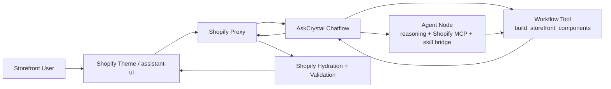

# Dify Storefront Component Architecture

## Goal

Define the standard Dify-native path for rich storefront UI in AskCrystal chat.

This document covers the Dify side of the contract:

- how Dify should decide that a component is needed,
- what shape Dify should return,
- how Shopify should hydrate and stream that data,
- how this stays separate from the existing skill-bridge patchwork.

For the frontend rendering contract, see:

- `docs/SHOPIFY_CHAT_COMPONENT_LIBRARY.md`
- `docs/SHOPIFY_COMPONENT_RENDERING_ARCHITECTURE.md`

## Decision

Use a `Dify Chatflow` as the main AskCrystal app and introduce a reusable `Workflow Tool` named `build_storefront_components`.

That workflow tool should return structured `component intents`, not final rendered Shopify cards.

The Shopify proxy remains the trust boundary that:

1. validates the component intent,
2. hydrates Shopify data from canonical product and collection references,
3. emits safe `component` SSE payloads,
4. lets the theme convert those payloads into `assistant-ui` tool-call parts.

## Current Bootstrap Status

As of April 24, 2026, the repository now includes a working render bootstrap for this architecture:

- Shopify proxy support in `apps/shopify/app/src/server/dify/local-dify-gateway.mjs`
  - forwards structured component payloads from Dify `node_finished` and `workflow_finished` events
  - emits first-class `component` SSE events
  - replays normalized components on the final `complete` payload
- A local Dify bootstrap app snapshot in `agent/dify/dsl/askcrystal-storefront-components-chatflow-2026-04-24.dsl.yml`
  - advanced-chat app
  - deterministic code-node output
  - no model dependency required
- Provisioning automation in `scripts/provision_storefront_component_flow.py`
- Proxy smoke test in `scripts/smoke_storefront_component_proxy.py`

This bootstrap path is intentionally narrower than the long-term architecture below.

It validates:

- Dify can stream structured component intents
- the Shopify proxy can hydrate those intents into normalized storefront payloads
- the proxy can fall back to preview hydration when Storefront API credentials are absent
- the theme can render them inline through `assistant-ui`

With `SHOPIFY_STORE_DOMAIN` and `SHOPIFY_STOREFRONT_ACCESS_TOKEN`, the same path can hydrate canonical Shopify Storefront API data. Without those credentials, the proxy derives preview product and collection payloads from the intent references so local rendering can still be validated end to end.

## Why This Is The Right Dify-Native Path

### Why not the skill bridge

The skill bridge exists because Dify does not have a first-class "skills" abstraction that matches the source repos we imported. It is useful for domain skills and patching capability gaps, but it is the wrong abstraction for presentation.

Storefront components are not domain skills. They are typed UI intents. They should not be modeled as pseudo-skills.

### Why not raw text markers

Embedding JSON in the answer body is acceptable only as a temporary bridge.

It is not the long-term contract because:

- the answer channel is text-first,
- parsing text for UI structure is brittle,
- Dify cannot reason cleanly about schema validity in plain prose,
- proxy and theme observability become weaker.

### Why not a bare `agent-chat` app

The current exported app is still `agent-chat`.

That is fine for pure conversational output, but it is awkward for this feature because we now need a reliable non-text output path. The richer the UI payload becomes, the more important it is to return structured workflow variables instead of hiding everything in answer text.

### Why a workflow tool

A workflow tool is the cleanest Dify-native abstraction here because it:

- is reusable across apps and nodes,
- has explicit input and output variables,
- can validate and normalize output inside Dify before the proxy sees it,
- avoids creating an external service just to echo JSON,
- keeps this feature separate from the skill bridge.

## Recommended Topology



## Separation Of Concerns

### Dify owns

- deciding whether a component is useful,
- choosing the component type,
- writing the narrative copy that belongs inside the component,
- referencing the correct product or collection entities.

### Shopify proxy owns

- product and collection truth,
- canonical titles, prices, URLs, images, availability,
- schema allowlisting,
- security and checkout/cart boundaries,
- SSE event emission.

### Theme owns

- actual presentation,
- responsive layout,
- click targets and visual hierarchy,
- mapping hydrated payloads to `assistant-ui` tool UIs.

## Contract Layers

There should be two different contracts.

### 1. Dify component intent contract

This is what Dify returns.

It is intentionally lightweight and reference-based. Dify should pass product references such as `product_id` or `handle`, not authoritative product display data.

Example:

```json
{
  "schema_version": 1,
  "components": [
    {
      "component": "product_card",
      "id": "sleep-primary",
      "priority": "primary",
      "props": {
        "eyebrow": "Prescription",
        "reason": "Best fit for calming overstimulation before sleep.",
        "cta_label": "View crystal",
        "product_ref": {
          "handle": "amethyst-pendant"
        }
      }
    }
  ]
}
```

### 2. Shopify hydrated render contract

This is what the proxy emits to the storefront.

It expands references into trusted Shopify data and matches the frontend component library.

Example:

```json
{
  "type": "component",
  "component": "product_card",
  "id": "sleep-primary",
  "props": {
    "eyebrow": "Prescription",
    "reason": "Best fit for calming overstimulation before sleep.",
    "ctaLabel": "View crystal",
    "product": {
      "id": "gid://shopify/Product/123",
      "handle": "amethyst-pendant",
      "title": "Amethyst Pendant",
      "url": "/products/amethyst-pendant",
      "image": "https://cdn.shopify.com/...",
      "price": "$48",
      "badge": "Calm"
    }
  }
}
```

## Recommended Dify Artifact Design

Create a reusable workflow tool:

- Name: `build_storefront_components`
- Type: `workflow tool`
- Output contract: `schema_version` + `components`

### Workflow tool inputs

- `answer_summary`
  - Short text summary of what the agent is recommending.
- `energy_blueprint`
  - Optional summary of the user's emotional or metaphysical state.
- `products`
  - Structured shortlist from Shopify tools.
- `collections`
  - Optional collection candidates.
- `allowed_components`
  - Enum-like list passed from the parent flow.
- `max_components`
  - Usually `1-3`.

### Workflow tool outputs

- `schema_version`
  - Currently `1`.
- `components`
  - Ordered array of component intents following `agent/dify/storefront_components/storefront-component-intent.schema.json`

### Workflow tool responsibility

The tool should decide only:

- which component types to emit,
- what order to show them in,
- what narrative fields belong in each component,
- which Shopify entities each component refers to.

The tool should not:

- fabricate prices,
- fabricate URLs,
- fabricate images,
- emit raw HTML,
- emit frontend tool names like `display_product_card`.

## Component Suite

Initial allowlist:

- `reading_summary`
- `product_card`
- `product_carousel`
- `ritual_card`
- `collection_link`
- `next_steps`

Recommended usage:

- `reading_summary`
  - Use when the answer opens with an "Energy Blueprint" and trust-building matters.
- `product_card`
  - Use for one strongest product recommendation.
- `product_carousel`
  - Use for 2-4 comparable matches.
- `ritual_card`
  - Use when practice or care instructions matter as much as the product.
- `collection_link`
  - Use when the user wants to browse wider than one SKU recommendation.
- `next_steps`
  - Use to keep momentum after the main recommendation.

Recommended per-turn limit:

- `1-3` components

Preferred ordering:

1. diagnosis or reading component
2. commerce component
3. lightweight follow-up component

## Parent Chatflow Design

Recommended structure:

1. `Inputs`
   - user message
   - conversation metadata
2. `Agent Node`
   - uses Shopify MCP tools and the existing skill-bridge tools
3. `Component Builder Step`
   - invoke `build_storefront_components`
4. `Answer Node`
   - return user-facing answer text
5. `Outputs`
   - include `components` as a structured workflow output for the proxy

Important detail:

The final answer text and the component intents should travel as separate outputs. Do not force the answer node to embed UI JSON unless the system is operating in fallback mode.

## Standard Rollout Path

### Phase 1. Define the contract

- Lock the Dify intent schema.
- Lock the Shopify hydrated schema.
- Keep the current inline `askcrystal-ui` parsing only as fallback.

### Phase 2. Build the workflow tool

- Implement `build_storefront_components` inside Dify as a reusable workflow tool.
- Keep it independent from the skill bridge.
- Version its output with `schema_version`.

### Phase 3. Move AskCrystal to Chatflow

- Replace the current `agent-chat` app with a `chatflow` wrapper.
- Keep the core reasoning in an Agent node.
- Expose `components` as a structured workflow output.

### Phase 4. Update the Shopify proxy

- Read workflow output variables from the Dify stream and final payload.
- Emit dedicated `component` SSE events.
- Hydrate all product and collection references from Shopify before emission.

### Phase 5. Tighten prompts and observability

- Prompt the agent to recommend components only when they improve clarity or conversion.
- Log which component types were emitted.
- Measure click-through and add-to-cart from each component type.

## Transitional Fallback

If the team is not ready to move from `agent-chat` to `chatflow` yet, use this temporary bridge:

1. add a standard Dify custom tool or workflow tool that returns the same component intent schema,
2. let the proxy extract that structured payload from whatever part of the Dify response currently exposes it,
3. keep inline fenced `askcrystal-ui` manifests as a temporary escape hatch.

This is acceptable as a bridge, but not the recommended end state.

## Decision Matrix

### `Skill bridge` as presentation tool

- Pros:
  - fast to patch in
- Cons:
  - wrong abstraction
  - couples UI rendering to the skill workaround layer
  - weaker long-term portability

### `External OpenAPI custom tool`

- Pros:
  - standard Dify tool surface
  - works without changing app mode immediately
- Cons:
  - still requires an external service for mostly local validation logic
  - adds another network hop

### `Workflow tool + Chatflow`

- Pros:
  - most Dify-native
  - typed outputs
  - reusable
  - easiest to keep separate from skills
  - strongest path for structured proxy emission
- Cons:
  - requires moving the main app from `agent-chat` to `chatflow`

## Prompt Rules For The Component Builder

- Prefer text-only answers when no visual surface adds value.
- Never emit more than one primary commerce surface in a turn.
- Use product references returned by Shopify tooling only.
- Keep language supportive and specific.
- Do not duplicate large chunks of the answer body inside the component.
- Do not use components to smuggle unsupported claims.

## Non-Goals

- Letting Dify author arbitrary storefront markup
- Putting checkout mutations inside component payloads
- Making Dify the system of record for catalog fields
- Replacing the existing skill bridge for domain skills

## Files In This Repo

- Dify-side component intent schema:
  - `agent/dify/storefront_components/storefront-component-intent.schema.json`
- Dify-side example payload:
  - `agent/dify/storefront_components/examples/sleep-grounding.json`
- Frontend render contract:
  - `apps/shopify/packages/storefront-ui/src/chat-components.mjs`
